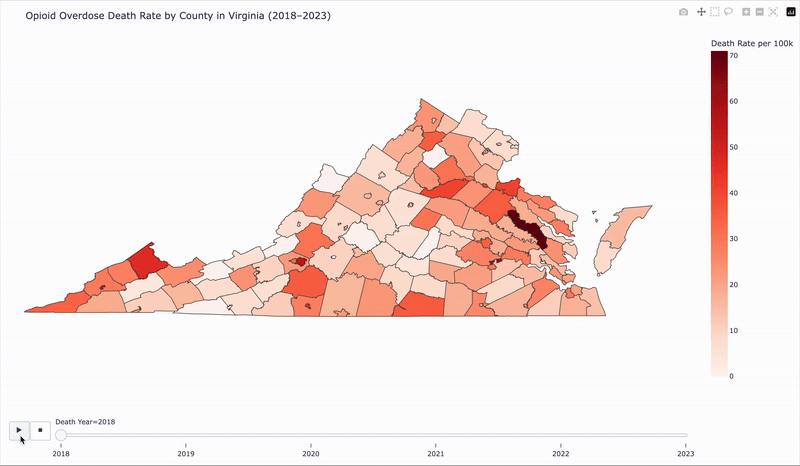

# Virginia-Opioid-Crisis

# Virginia Opioid Overdose Heat Map (2018–2023)

The following map shows opioid overdose death rates per 100,000 people by county and year in Virginia. You can click the image to view the full interactive map. 

Data Source: CDC 
Created using Python and Plotly
